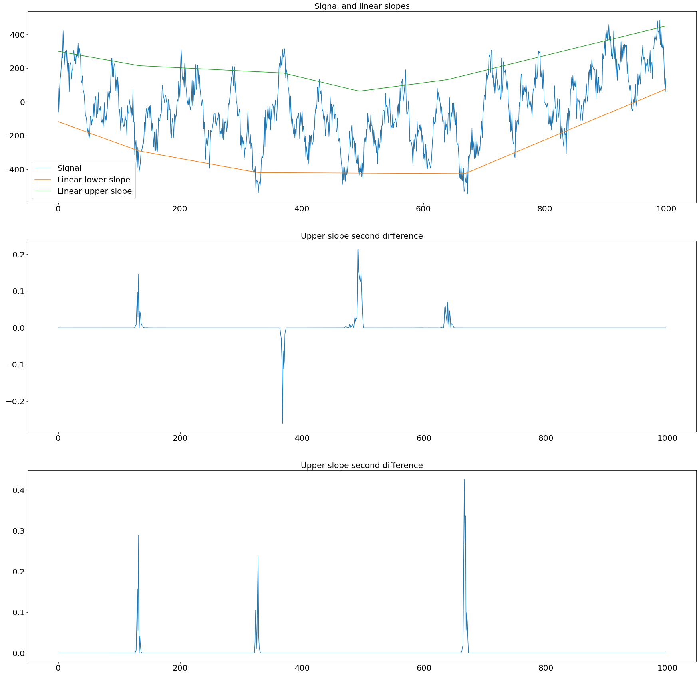

# Asymmetric Total Variation Denoising

## Asymmetric Linear Total Variation 

Generates piecewise-linear slopes for signal due to sparsing the second difference with joint optimization of the weighted least squares.

